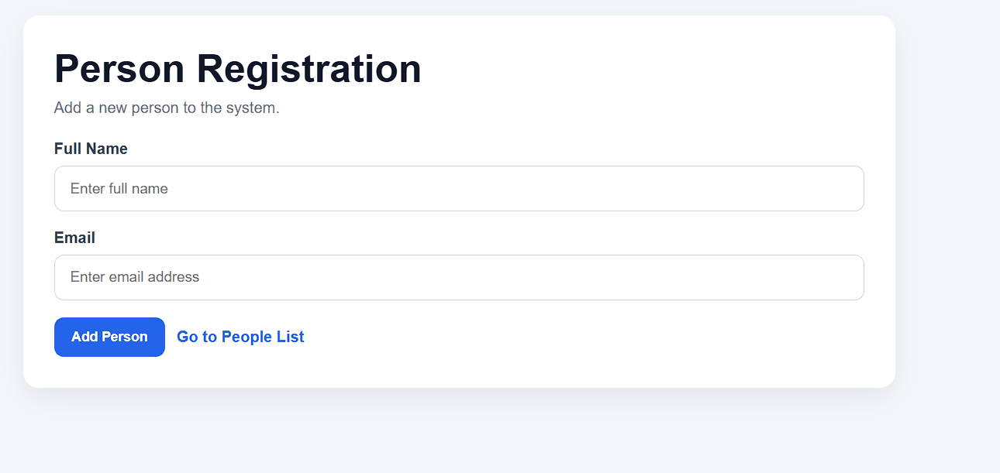
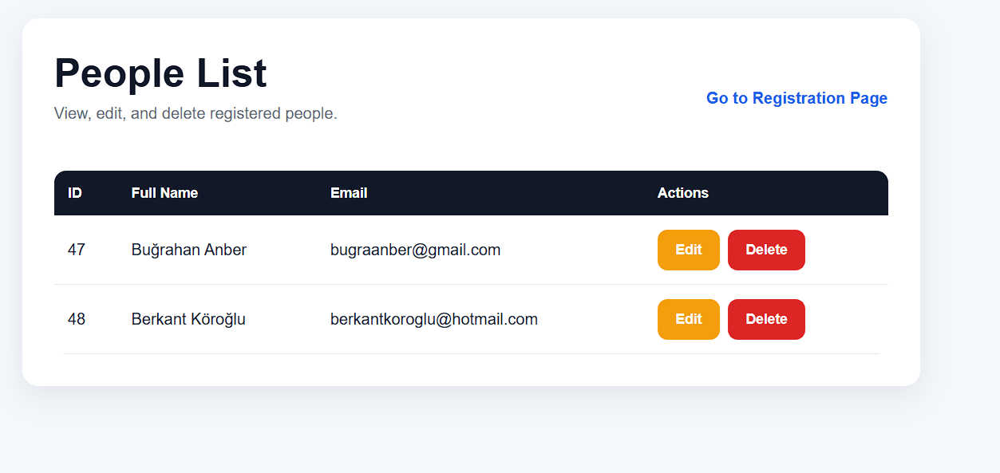
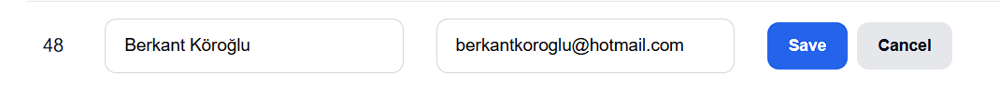

# Person Management System

This project is a full-stack web application that allows users to manage people records. Users can add, view, update, and delete people. The system is built using React for the frontend, Express.js for the backend, PostgreSQL as the database, and Docker for containerization.
---

## Features

- Add new person
- View all people
- Update existing person
- Delete person

---

## Technologies

- React
- Node.js / Express.js
- PostgreSQL
- Docker
- Docker Compose

---

## API Endpoints

- GET `/api/people`
- GET `/api/people/:id`
- POST `/api/people`
- PUT `/api/people/:id`
- DELETE `/api/people/:id`

---

## How to Run

### 1) Clone the repository 

```bash
git clone https://github.com/berkantkoroglu/person-management-docker.git
cd person-management-docker
```

### 2) Run the application

docker compose up --build

### 3) Open in browser

- Frontend: http://localhost:3000/
- Backend: http://localhost:5000/api/people

---

## Screenshots

### Registration Page


### People List


### Edit people informations from people list

